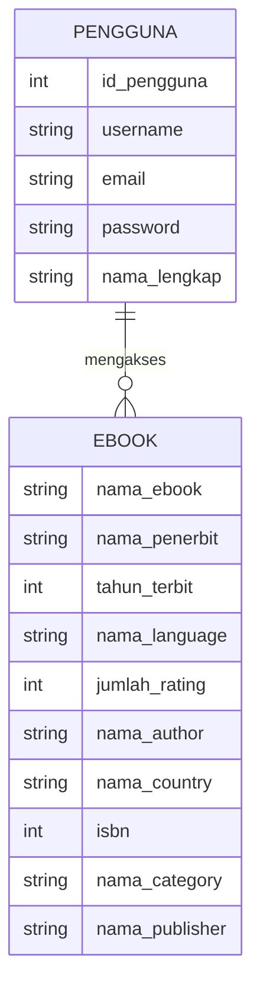
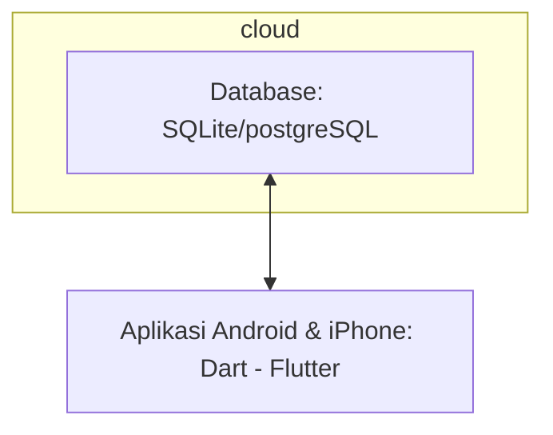

## 1.1 Latar Belakang

Dengan berkurangnya minat baca masyarakat yang semakin meningkat yang merupakan satu diantara beberapa dampak yang terjadi akibat kemajuan teknologi. Maka diciptakan teknologi berupa aplikasi untuk menjembatani hal tersebut, sehingga dapat memudahkan bagi para pengguna untuk mengakses kebutuhan yang ada.
## 1.2. Deksripsi Teknologi Informasi

Teknologi informasi yang dibuat ialah berupa aplikasi perpustakaan berbasis mobile, yang mana didalamnya berisi kumpulan ebook yang disediakan oleh pencipta. Aplikasi ini akan menjadi sebagian dari alat solusi untuk menyelesaikan permasalahan yang terjadi pada masyarakat. Tidak hanya itu, adanya teknologi informasi ini juga dapat mendukung pembelajaran siswa maupun mahasiswa dalam melaksanakan studi mereka. Pengguna dapat mencari, membaca dan menandai ebook yang disukai dalam aplikasi ini.

## 1.3. Branding

- Merk: mylib.
- Tagline: Membaca lebih praktis pada layar minimalis.
- Campaign: Bagaimana membuat aplikasi yang dapat meningkatkan minat baca pengguna.
- Target user:
  - Usia 7+
  - Orang yang senang membaca
  - Orang yang ingin mencari ilmu pengetahuan
  - Orang yang sedang menekuni suatu pengetahuan
  - Orang yang ingin lebih simple dalam membaca buku
- User experience theme:
  - Mudah
  - Sederhana
  - Simple

## 2. User Story

Sebagai | Saya ingin bisa | Sehingga | Prioritas
---|---|---|---
Pengguna | mencari ebook | mendapatkan ebook yang akan dibaca | ⭐⭐⭐⭐⭐
Pengguna | menandai ebook | bisa menyatukan tempat penanda buku | ⭐⭐⭐⭐
Pengguna | melihat detail buku | mengetahui spesifikasi buku terkait | ⭐⭐⭐⭐
Pengguna | membaca ebook | dapat membaca isi dari ebook terkait | ⭐⭐⭐⭐⭐
Pengguna | memberi rating ebook | rating muncul | ⭐⭐⭐
Pengguna | memberi comment ebook | comment muncul | ⭐⭐⭐

## 3. Struktur Data

## 4. Arsitektur Sistem

## 5. Teknologi, Library, dan Framework
Project ini dibangun dengan menggunakan teknologi bahasa pemrograman dart yang termasuk dalam framework flutter dilengkapi oleh library bloc yang ada pada flutter itu sendiri.

## 6. Desain User Experience dan User Interface

## 7. Demonstrasi Video

Link youtube nya

## 8. Bagaimana mesin komputasi dan sistem operasi berperan dalam produk teknologi informasimu ?

Link youtube nya di detik jawaban ini

## 9. Bagaimana algoritma, struktur data, dan bahasa pemrograman berperan dalam produk teknologi informasimu ?

Link youtube nya di detik jawaban ini

## 10. Bagaimana metode pengembangan perangkat lunak / Software Development Life Cycle berperan dalam produk teknologi informasimu ?

Link youtube nya di detik jawaban ini

## 11. Bagaimana database / sistem basis data berperan dalam produk teknologi informasimu ?

Link youtube nya di detik jawaban ini
